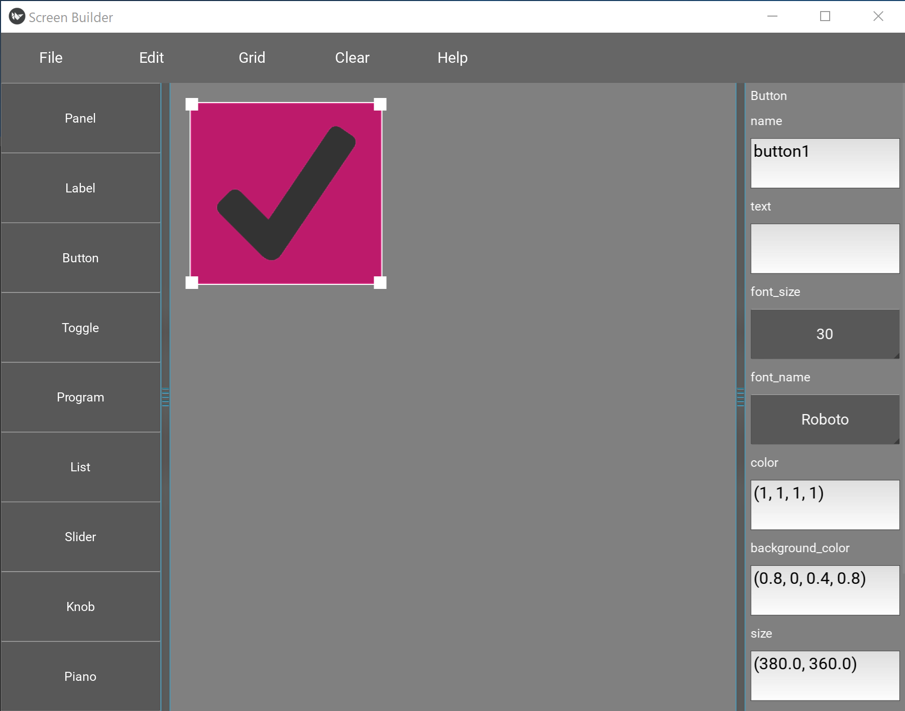

## Hi there 👋 pythonistas and GUI enthusiasts.

## Welcome to the Python GUI Screen Builder project.

The Python screen builder is an easy to use tool you can use to create and load a screen for an application.
The GUI it uses is Kivy, but don't worry - the screen builder makes it easy and fun to use.
This is what the main screen looks like:



```
# it is fun to program in python
```
First of all, when you run the screen builder (the exe version) it works without any Kivy dependencies.
But, when you want to start coding to access the screen and widgets, you need to install Kivy.
It's easy, Kivy is simple to install. You can find out how to install Kivy here:
<a href="https://kivy.org/doc/stable/gettingstarted/installation.html">Installing Kivy</a>

Basically it boils down to installing the Kivy framework and its dependencies: angle, glew, sdl2.
For example on Windows which is what the screen builder currently runs on:
```
python -m pip install "kivy[base]" kivy_examples
```
## How to use

First when you run the screen builder you can select from an array of GUI widgets on the sidebar.
Select a Button control for instance, change its text, font, etc. Then File -> export -> test_screen.json
The json file contains all the information about the GUI controls. Also make sure the name field is filled in.
It should automagically default to button1. That is how you can reference it in your Python application.

Here is the sample code for a working application that loads the screen. You can use this as a template if you like:
```
from gui import *
from kivy.app import App
from widget_screen import WidgetScreen

class TestScreen(WidgetScreen):

    def __init__(self, **kwargs):
        screen = kwargs.get('screen')
        super(TestScreen, self).__init__(**kwargs)
        self.screen = screen
        self.load_screen()
        self.button1.bind(on_press = self.on_press)

    def on_press(self, button):
        print("Button, button - you clicked the button!")
        pass

class TestApp(App):

    def build(self):
        Window.clearcolor = 'steelblue'
        screen = Screen(name = "Test")
        self.test_screen = TestScreen(file_name = 'test_button.json', screen = screen)
        return screen

if __name__ == '__main__':
    TestApp().run()
```
If everything is working when you run the program:
```
py test_app.py
```
You should see a screen like this:

And then when you click on the button ... it should say something in the console window.
Now if you wanted to create an exe with no console window, you need to install pyinstaller.
And you would do: pyinstaller -F --noconsole test_app.py
But that's another story, just try to get the inital test app to work first. 😉

<!--
**python-screen-builder/python-screen-builder** is a ✨ _special_ ✨ repository because its `README.md` (this file) appears on your GitHub profile.

Here are some ideas to get you started:

- 🔭 I’m currently working on ...
- 🌱 I’m currently learning ...
- 👯 I’m looking to collaborate on ...
- 🤔 I’m looking for help with ...
- 💬 Ask me about ...
- 📫 How to reach me: ...
- 😄 Pronouns: ...
- ⚡ Fun fact: ...
-->
