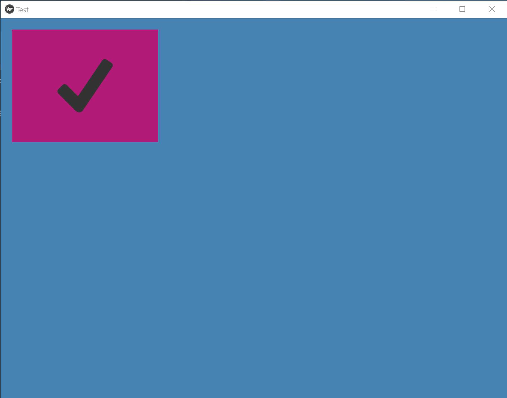

## Hi there 👋 pythonistas and GUI enthusiasts.

## Welcome to the Python GUI Screen Builder project.

The Python screen builder is an easy to use tool you can use to create and load a screen for an application.
The GUI it uses is Kivy and the screen builder makes it easy and fun to use.
This is what the main screen looks like:


```
# it is fun to program in python if you have a nice gui builder
```
First of all, you will need to install the Kivy framework in order to run the screen builder.

You can find out how to install Kivy here:
<a href="https://kivy.org/doc/stable/gettingstarted/installation.html">Installing Kivy</a>

## How to use

You can download all of the Python files from the sb folder to a separate location. Then, simply type:

```
py main.py
```
The screen builder main window should appear. You can then start to building screens to be used with the GUI.
The sb_test folder contains the test application which you can be used as a template.

When you run the screen builder you can select from an array of GUI widgets on the sidebar.
Select a Button control for instance, change its text, font, etc. Then File -> Export -> your_screen.json to save.
The json file contains all the information about the GUI controls you selected. Also make sure the name field is filled in.
It should automagically default to button1. That is how you reference controls it in your Python application.

Here is the sample code for a working application that uses the screen file test_button.json
```
from gui import *
from kivy.app import App
from widget_screen import WidgetScreen

class TestScreen(WidgetScreen):

    def __init__(self, **kwargs):
        screen = kwargs.get('screen')
        super(TestScreen, self).__init__(**kwargs)
        self.screen = screen
        self.load_screen()
        self.button1.bind(on_press = self.on_press)

    def on_press(self, button):
        print("Button, button - you clicked the button!")
        pass

class TestApp(App):

    def build(self):
        Window.clearcolor = 'steelblue'
        screen = Screen(name = "Test")
        self.test_screen = TestScreen(file_name = 'test_button.json', screen = screen)
        return screen

if __name__ == '__main__':
    TestApp().run()
```
If everything is working, when you run the test program:
```
py test_app.py
```
You should see a screen like this:



And then when you click on the button it should say something in the console window.

That's it, simple and easy to use. More to come, stay tuned ... 😉

<!--
**python-screen-builder/python-screen-builder** is a ✨ _special_ ✨ repository because its `README.md` (this file) appears on your GitHub profile.

Here are some ideas to get you started:

- 🔭 I’m currently working on ...
- 🌱 I’m currently learning ...
- 👯 I’m looking to collaborate on ...
- 🤔 I’m looking for help with ...
- 💬 Ask me about ...
- 📫 How to reach me: ...
- 😄 Pronouns: ...
- ⚡ Fun fact: ...
-->
